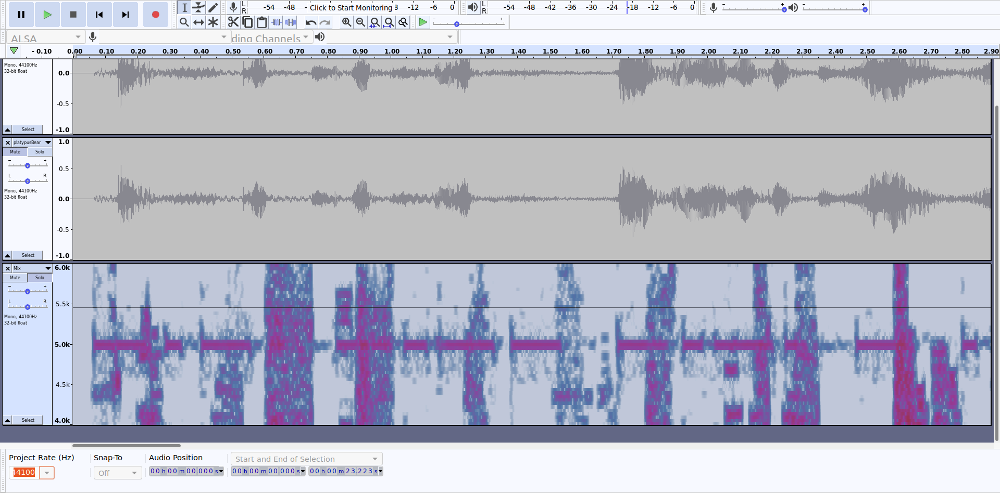

# Writeup for Cyber Yoddha CTF 2020

### YayRev

- We have to reverse a python program.

- The program was just taking last 5 characters of the original flag and pasting it in the front of it.

- And then it would do some calculations on it for encoding.

- We can just take all possible printable characters from `string` module, and map the encoded data to original data.

### RSA

- Given the names of people are the authors of RSA.

- Basically we are given encrypted data as the location where they will meet.

- We are also given n, e and `*1e-6` in the question.

- So decrypt the data using RSA, and multiply with `1e-6` to get latitude and longitude of `Louvre Musuem` which is the answer.

### DNA

- Clearly we are given the DNA cipher.

- We have to search for some variant of the DNA cipher, after googling for a bit I found [this](https://github.com/ctfs/write-ups-2016/tree/master/qiwi-infosec-ctf-2016/crypto/3-100)

- Then used a OCR, and used a python script to get a flag.

### Morse Code

- This question has a audio mixed in with a morse code.

- I followed this [writeup](https://ctftime.org/writeup/18400) I had found some time ago for finding the morse code.

- 

- As you can see the 'dashes' and 'dots' in the 3rd row.

- Write the code and then decode it on CyberChef!

### Hash Browns

- There are some ways to get all the cities in France.

- I had tried getting list from UN/LOCODE but it's over 11,000 cities ! So I downloaded only the prominent ones from https://simplemaps.com/data/fr-cities

- Then used the script to get the flag.

### Problems involving Hash

- We can use Hashcat & Hash Identifier with rockyou to find the answer.

- We can also use online databases like crackstation to search the hash.
