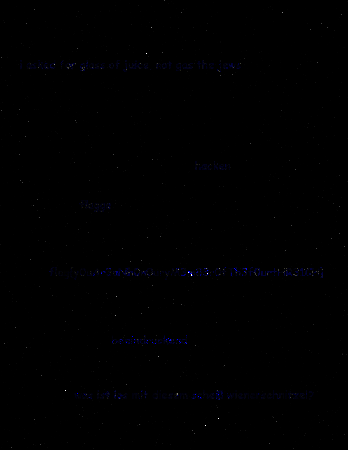
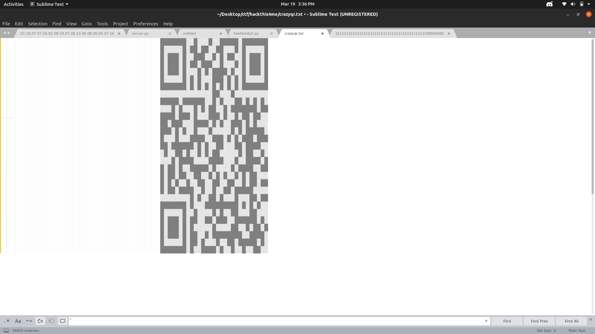

# HackThis4Me Writeups

## Forensics

### Extensions are ....Meh

Description : K3chup isn't interested in extensions. Can you guess why by finding the flag?

Given a file, if we run the file command 

```console
kali@kali:~$ file question
question : PNG Image Data
```

Open it in a Image Viewer to get the flag.

Flag : flag{EXTENSIONS_ARE_A_LIE}

### Mein Fuhrer

Description : Pyromaniac was afraid that previous steganographic method was less secure, so he used another method of hiding the message. help the gang receive the message.

We are given a jpg file, the flag is hidden in the binary of the file.Run strings and grep the flag.

```console
kali@kali:~$ strings mein_fuhrer.jpg | grep "flag{" | head -1
flag{y0u_F0unD_3x1F_D@t@_VuLn3r@81L1tY}

```

Flag : flag{y0u_F0unD_3x1F_D@t@_VuLn3r@81L1tY}

### Mein Fuhrer Returns

Description : The gang wants to communicate with pyromaniac without being noticed. this time the message is of utmost importance, and the surveillance has been improving. so this time pyromaniac sent them two images one is the hint and other is the message. help the gang extract the message.

After downloading the two images, I had done a similiar questions which involved XORing two images.To do that either use Stegsolve -> Image Combiner or this command.

It use imagemagick tool, so you should install it first.Basically using AND and OR to XOR all the pixels in the images.Save in bmp format for maximum quality.
```console
kali@kali:~$ convert fuhrer1.jpg fuhrer2.jpg -fx "(((255*u)&(255*(1-v)))|((255*(1-u))&(255*v)))/255" flag.bmp
****
```


Flag : flag{y0uAr3oNh0n0uryM3m83rOfTH3f0urtHR31CH}

### Bro who is this?

Description : PyroManiac has given a task to TheRrockstar to meet up with a guy but TheRrockstar can't identify the person in picture. Help him to identify the personality in picture.

You will given a picture of someone, instead of finding about that person we can try to find something about the image. I tried a tool called stegoVeritas on the picture and managed to extract a hidden key - "SomeR4nD0M_Shit"

This key can be used with steghide to extract a hidden zip file.
```console
kali@kali:~$ steghide extract -sf Identify_me.jpeg
```

Flag : flag{HeY_Y0U_f0UND_M3}

### Sensory Overload

Description : Sceptical of probable eavesdropping issues, pyromaniac decided to use audio files to transfer messages. the gang is really on a tight schedule, so help them decipher the message.

I tried viewing the spectogram of audio file and got the flag.

Flag : flag{V15uAl153Aud10}

### Are_You_Watching_Closely

Description : PyroManiac likes to test every-now-and-then whether the gang is working as he asked them to or not. He requires the gang to approach problems with a fresh perspective and try to visualize the problem at hand, so sent them this message. Help it the gang decode this message.

You will be given a really weird text file, with characters like '&| etc...
I had seen these somewhere previousely, I tried to search some esoteric programming language and found out about malbolge.
The text as of malbolge language !!
Now to find a online translator of this language but the challenge is just starting ;)

You will find the decoded version to contain 0s and 1s.There are in binary pattern ! I tried to open them in Sublime 3.
You can see a pattern like a QR code, in scroll mini bar.
Now to scan this code, I knew the 1s should represent the black pixels and 0s the white.

After some time, I thought about selecting all the 1s in a black color. First I had to change the theme to Sixteen to get a white-ish background. Now if you ctrl+F for 1 and click on find all. We can highlight the 1s in black color. Now to scan this, I had previousely used a tool known as zbarimg. I took a screenshot of the Sublime.



Then cropping the unnecessary stuff to get the qr code, and making it a square of appropriate size, we can export it.


Now just use the zbarimg to scan the code.

```console
kali@kali:~$ zbarimg qr.png
QR-Code:flag{1F_y0U_l0oK_c1Os3lY_EV3rY7h1N9_i5_1s_4nD_0s}
```

Flag : {1F_y0U_l0oK_c1Os3lY_EV3rY7h1N9_i5_1s_4nD_0s}

Edit : Here is a similiar question https://github.com/chaocipher/Writeups/blob/master/B01lers%20CTF%202020.pdf

### Suspicious Picture

Description : The college authorities are making it harder and harder for PyroManiac to communicate with his friends. To combat this problem, PyroManiac devises a new method of communication with his friends: Pictures. Unfortunately he is unable to send how to find message from the pictures. But his friends are smart enough to extract message. What was the message?

Doing binwalk and extracting two images from given file.
We xor both the pictures to get the flag.

Flag : FLAG{X0R_1S_P0W3RFUL}

### passwd nahi pata

Description : K3chup and ripedodo are planning some prank to perform on Jethiya's birthday. Aware of this fact grizzly starts his detection and capture .pcap file And found some secret key.

Flag is Secret Key in format "flag{secretkey}"

Still grizzly didn't know what is the use of this secret key. :p

Extract a flag.txt file using wireshark.

Flag : FLAG{ProXy_sucksss}

### Dil toot gya?

Description : Jethiya was downloading his love-letter from the internet when his ex casted a spell, which led it to pieces. Help Jethiya in recovering the secret. Captured Packet File\n\nEnter flag as "flag{message you got}"

Again extract all the files using binwalk and you will find a file containing flag.

```console
kali@kali:~$ binwalk outputfiles.pcap -D=".*"
```

Flag : FLAG{AP_is_amazing}


## Cryptography

### Suspicious MP3

Description : K3chup isn't interested in extensions. Can you guess why by finding the flag?

Given a file, if we run the file command 

```console
kali@kali:~$ file question
question : PNG Image Data
```

Open it in a Image Viewer to get the flag.

Flag : flag{EXTENSIONS_ARE_A_LIE}

### Railway Crossing

Description : Grizzly and n00bie are at the Railway Station ready to solve the next challenge the hacker gives them. There they stumble upon a very suspicious piece of text "F{5CMLGRW@D0UN}A0NL5" with 3 lines drawn underneath. They believe this is part of the challenge but are unable to figure out what the text means. Help them decrypt the text.

This is [rail fence cipher](https://www.dcode.fr/rail-fence-cipher).

Flag : FLAG{R0W5@NDC0LUMN5}

### Am I safe?

Description : MeeSeeks uses some form of SHA encryption for their passwords. PyroManiac hacked into the system of MeeSeeks and extracted this string. Find out what is the password of MeeSeeks. "e4ecd6fc11898565af24977e992cea0c9c7b7025"

We can find the decrypted text in a public database like md5encrypt.net

Flag : flag{hello_world}

## General Skills

### Numbers aren't real

Description : N00bie sent some numbers to Gujju but gujju forget to decode'em. Help him. 70 108 97 103 123 52 83 67 73 73 95 73 115 95 52 95 76 105 51 125

Given is a alphabets in ASCII numbers. You can convert using ASCII table or use the chr() function in python to autoamte the process.

```python
a = '70 108 97 103 123 52 83 67 73 73 95 73 115 95 52 95 76 105 51 125'.split()
a = [chr(int(i)) for i in a]
print(''.join(a))
```

Flag : Flag{4SCII_Is_4_Li3}

### My Base isn't strong

Description : Gujju likes stronger encoding than n00bie so he sent this message to n00bie. But n00bie is a n00b and don't know how to decode this message. Help him
Message: RmxhZ3tDME52M1JzITBuX0QwM3NOJ1RfU3QwcF9NM30=

This is a base64 string, you can decode this from online tools available.

Flag : Flag{C0Nv3Rs!0n_D03sN'T_St0p_M3}

### Grep my hands forever

Description : Gujju is feeling lonely and wants to grep someone hands forever. So he wrote a play for himself in which he can grep someone's hand forever cough not like that cough find his true emotions.

Read about the grep command in linux.

```console
kali@kali:~$ cat GujjuAndHer | grep -i flag
flag{I_use_grep_cuz_ctrl+f_sucks}
And death's pale flag is not advanced there.
```

Flag : flag{I_use_grep_cuz_ctrl+f_sucks}


### Networking Kitty

Description : My cat is so smart that she can browse internet without web browser. Can you do the same? :3

Link: http://hackthisfor.me:4000

The question name refers to the nc (or netcat) command in linux. 

```console
kali@kali:~$ nc hackthisfor.me 4000
Welcome to the terminal community folks.Type below "flag" to get flag:
flag
Flag{My_K!ttY_t4UGht_m3_n3TC4T}
```

### Networking Kitty 2 & 3

Description : My kitty isn't smart enough to solve mathematical equations. So help her to solve those. :3

Link: http://hackthisfor.me:4001

I taught my cat to solve mathematical equations and now she can solve faster than "Scott Flansburg". Can you match her speed?", :3

Link: http://hackthisfor.me:4002

The question name refers to the nc (or netcat) command in linux. Also you have to solve the questions given and input the answer. In the NK3 you have to do it fast enough, this can be done by python. Infact both can be done by python.

```python
from pwn import *
#nc 104.211.178.217 4001
s = remote('104.211.178.217',4002)
s.sendline(str(eval(repr(s.recv())[2:-3])))
print(s.recv())
s.close()
```
The pwntools module is extremely useful in questions like these.

```console
kali@kali:~$ python ape.py 
[+] Opening connection to 104.211.178.217 on port 4001: Done
b'Flag{!_Kn0W_M4THS_LOL}'
[*] Closed connection to 104.211.178.217 port 4001
(base) 
kali@kali:~$ python ape.py 
[+] Opening connection to 104.211.178.217 on port 4002: Done
b'Flag{WOW_What_4_Sp33D}'
[*] Closed connection to 104.211.178.217 port 4002

```

### The hex family

Description : One day Gujju got a pink letter from a family member of The Hex family. But he don't understand what was it. Help Gujju to find out what was written in letter.

You are given a bunch of hexadecimel numbers, use the xxd command in linux to convert to a file.

```console
kali@kali:~$ xxd -r -p thehexfamily image.png
```
The image has the flag. Read [this](https://stackoverflow.com/questions/7826526/transform-a-hex-info-to-binary-using-linux-command) for converting hex to binary files.

Flag : flag{mspaintrocks}

### The hex family 2

Description : Gujju is now able to read hex letters but now the letter is written by little family member of The Hex family. Help Gujju to read letter once again. Maybe he'll find his love.

Also a hexdump but in every 4 bytes, first two bytes are interchanged. 
```python
file = open('HexFamily2.txt')
newfile = open('newHexFamily2.txt','w')
l = file.readlines()
l1 = []
print(l[0:2])
for line in l:
	x = line
	x= x.strip('\n').split()
	y = []
	for i in x:
		hx = i[:2]
		hx1 = i[2:]
		hx,hx1 = hx1,hx
		y.append(hx+hx1)
	new = ' '.join(y)+'\n'
	l1.append(new)
newfile.writelines(l1)
newfile.close()
file.close()
```

```console
kali@kali:~$ xxd -r -p newHexFamily2.txt out
```
Out will also be a png file.

Flag: flag{I_d0nT_f0rG3T_endianness}

## Quiz

### RSA 01,02 & 03

Wikipedia page of RSA has useful info for us to work on the challenge.

```python
from Crypto.Util.number import inverse, long_to_bytes

e = 3
p = 4547
q = 5393
n = p * q
phi = (p-1) *(q-1)
d = inverse(e,phi) # decryption key

c = 14150944
#m = pow(c,d,n)
m = 322420463

print(repr(long_to_bytes(m)))
```

## Reverse Engineering

A decompiler like JD-Gui will be helpful in these challenges.

### Lets meet up 01

Description: PyroManiac has organised a meet-up with other hackers to discuss about a recent exploit. This meet-up is in the night as hackers want to protect their idendity but girls and first years boys are trapped in Hostels because of time so they break into cams to disable them and join meet-up. Source code of disabling cams are leaked by a hacker \"Gujju\", use it to disable cams.

Simply open the file or find the admin & password.

Flag : Flag{j4j4_is_e4sY_to_D3C0mp1Le}

### Lets meet up 02

Description: Admin soon find out that cams are disabled and finds out that someone knows the admin password so he changes it. Disable the cams again.

Open the class file in JD-GUI and retrieve the password in text format. Remember to rename the file as GetMeOut2.class

```console
java GetMeOut2
```

Flag: Flag{J4J4_1S_V3Ry_E4Sy_to_decOmpiLe}

### Lets meet up 03

Description: Please complete Let's meet up-02 before attempting this.
Admin is frustated as people finds admin password very easily. So he asked a student Rrockstar99 to code a secure app. He made a app which is uses basic encryption to avoid storing password in readable format. Since he is philomath and didn't want to give too much effort in it. So its very easy to hack into. Disable the cams again.

Note: Rename the file GetMeOut3.class after downloading.

Opening the decompiler, notice that admin is admin but the password is not in text format. It is checked by a function. Convert it in python syntax.

The check function check the length of pass as 28 and xor all the elements in the array with 0x24 to generate ASCII integer, converting into character form we get the password.

```python
# arrayOfChar = list(paramString) 
arrayOfInt = [ 
    112, 108, 5, 87, 123, 5, 87, 123, 105, 20, 
    119, 80, 123, 119, 23, 103, 81, 118, 65, 123, 
    116, 100, 119, 119, 115, 20, 118, 96 ]
for b in range(28):
    x = arrayOfInt[b] ^ 0x24
    print(chr(x),end='')
```
```
TH!s_!s_M0St_S3CuRe_P@SSW0RD
```

Flag : Flag{X0R_is_V3Ry_Us3Fu!!_iN_enCRYpt!0N}

## Binary Exploitation

### Road to Binary 0x00

Run the binary to get the flag.

Flag: FLAG{R04D_T0_BIN4RY_123}

### Road to Binary 0x01

You have to enter the password after running the binary. We can use ltrace on this binary to see the running code of the binary. 
```console
kali@kali:~$ ltrace ./Game_test_version 
__libc_start_main(0x400686, 1, 0x7ffd5c2f73f8, 0x400880 <unfinished ...>
puts("Enter your lock password"Enter your lock password
)                 = 25
__isoc99_scanf(0x40093d, 0x7ffd5c2f7270, 0x7ff650ed5580, 0x7ff650dfb024
1111
) = 1
strcmp("1111", "P1NGU_1S_B3ST_C4RT00N_3V3R")     = -31
puts("wrong password!!! \nIncident will"...wrong password!!! 
Incident will be reported to owner
)     = 54
+++ exited (status 0) +++
```
The entered password is compared to this string, so that must be the password ! Let's check it.

```
P1NGU_1S_B3ST_C4RT00N_3V3R
```

We can find it using strings command too. :D


Flag: FLAG{N3V3R5T0R3P455W0RD1NSIDECODE}