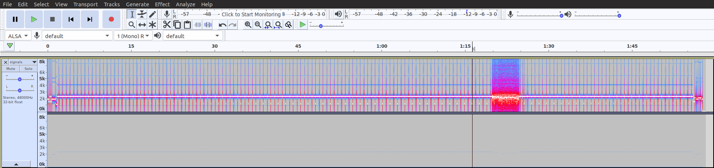
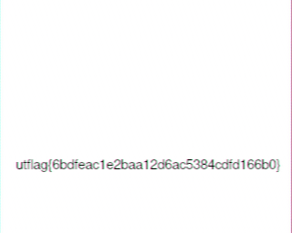
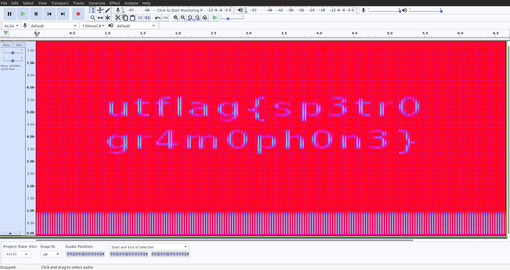

# UTCTF-2020 Writeups

## Forensics

### 1 Frame per Minute

Description : I recently received this signal transmission known as SSTV in a mode called Martian? This technology is all very old so I'm not sure what to do with it. Could you help me out?

The question gives us a signals.wav file. We can open it in Audacity to analyze it or look at its spectogram.
The problem gives us a hint about something called SSTV.
If we look it up on the Wikipedia, it is a way to transmitt images in audio form.



I then searched for converting this audio signal back to it's Image form on google.

I found [this](https://ourcodeworld.com/articles/read/956/how-to-convert-decode-a-slow-scan-television-transmissions-sstv-audio-file-to-images-using-qsstv-in-ubuntu-18-04) to be a very good guide for it.
The qsstv program will decode the audio and give us an image with the flag.



### basics[forensics]

Description : My friend said they hid a flag in this picture, but it's broken! Now that I think about it, I don't even know if it really is a picture...

Pretty basic challenge as says its name, using the file  command.

```console
foo@bar:~$ file secret.jpeg
secret.jpeg: UTF-8 Unicode text, with CRLF line terminators
```

So it's a text file, opening it would reveal it's a book!
The flag must be hidden in the text, using the grep command flag will be revealed.
```console
foo@bar:~$ cat secret.jpeg | grep -i "utflag"
utflag{fil3_ext3nsi0ns_4r3nt_r34l}
```

### Observe Closely

Description :A simple image with a couple of twists...

We are given this image


Trying to binwalk the file reveals a Zip file inside the png file.
```console
foo@bar:~$ binwalk Griffith_Observatory.png 

DECIMAL       HEXADECIMAL     DESCRIPTION
--------------------------------------------------------------------------------
0             0x0             PNG image, 320 x 155, 8-bit/color RGBA, non-interlaced
41            0x29            Zlib compressed data, default compression
127759        0x1F30F         Zip archive data, at least v2.0 to extract, compressed size: 2587, uncompressed size: 16664, name: hidden_binary
130500        0x1FDC4         End of Zip archive, footer length: 22
```

We can extract the Zip file using binwalk -e, giving us a folder contaning a file called hidden_binary.

```console
foo@bar:~$ ./hidden_binary 
Ah, you found me!
utflag{2fbe9adc2ad89c71da48cabe90a121c0}
```
### Spectre

Description : I found this audio file but I don't think it's any song I've ever heard... Maybe there's something else inside?

Opening the file in audacity and turning on spectrograph.



Voila! Flag in the spectrogram.
