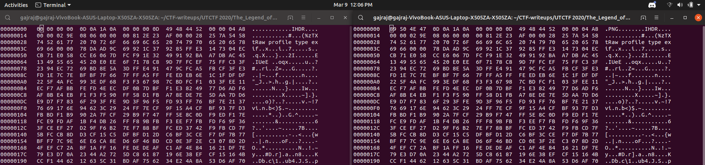
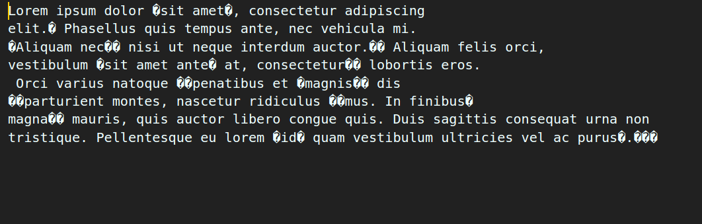

# UTCTF-2020 Writeups

## Forensics

### 1 Frame per Minute

Description : I recently received this signal transmission known as SSTV in a mode called Martian? This technology is all very old so I'm not sure what to do with it. Could you help me out?

The question gives us a signals.wav file. We can open it in Audacity to analyze it or look at its spectogram.
The problem gives us a hint about something called SSTV.
If we look it up on the Wikipedia, it is a way to transmitt images in audio form.


I then searched for converting this audio signal back to it's Image form on google.

I found [this](https://ourcodeworld.com/articles/read/956/how-to-convert-decode-a-slow-scan-television-transmissions-sstv-audio-file-to-images-using-qsstv-in-ubuntu-18-04) to be a very good guide for it.
The qsstv program will decode the audio and give us an image with the flag.


### basics[forensics]

Description : My friend said they hid a flag in this picture, but it's broken! Now that I think about it, I don't even know if it really is a picture...

Pretty basic challenge as says its name, using the file  command.

```console
foo@bar:~$ file secret.jpeg
secret.jpeg: UTF-8 Unicode text, with CRLF line terminators
```

So it's a text file, opening it would reveal it's a book!
The flag must be hidden in the text, using the grep command flag will be revealed.
```console
foo@bar:~$ cat secret.jpeg | grep -i "utflag"
utflag{fil3_ext3nsi0ns_4r3nt_r34l}
```

### Observe Closely

Description :A simple image with a couple of twists...

We are given this image


Trying to binwalk the file reveals a Zip file inside the png file.
```console
foo@bar:~$ binwalk Griffith_Observatory.png 

DECIMAL       HEXADECIMAL     DESCRIPTION
--------------------------------------------------------------------------------
0             0x0             PNG image, 320 x 155, 8-bit/color RGBA, non-interlaced
41            0x29            Zlib compressed data, default compression
127759        0x1F30F         Zip archive data, at least v2.0 to extract, compressed size: 2587, uncompressed size: 16664, name: hidden_binary
130500        0x1FDC4         End of Zip archive, footer length: 22
```

We can extract the Zip file using binwalk -e, giving us a folder contaning a file called hidden_binary.

```console
foo@bar:~$ ./hidden_binary 
Ah, you found me!
utflag{2fbe9adc2ad89c71da48cabe90a121c0}
```
### Spectre

Description : I found this audio file but I don't think it's any song I've ever heard... Maybe there's something else inside?

Opening the file in audacity and turning on spectrograph.


Voila! Flag in the spectrogram.

### The Legend of Hackerman Part 1

Description : My friend Hackerman tried to send me a secret transmission but I think some of it got messed up in transit. Can you fix it?

When I opened the given file using hexedit since file command basically it is just a data file.
I noticed that the instead of a magic number for a PNG in start, first 4 bytes were 00 00 00 00.
I changed them to 89 50 4E 47, the correct magic number.
```console
foo@bar:~$ hexedit hackerman.png
```



Changing the bytes will let us view a image of the HACKERMAN Rami Malek.


### The Legend of Hackerman Part 2

Description : Ok, I've received another file from Hackerman, but it's just a Word Document? He said that he attached a picture of the flag, but I can't find it...

After running strings on the given docx file, I ran binwalk and extracted everything.
```console
foo@bar:~$ binwalk -e Hacker.docx
```

In a folder called 'media' nested in the extracted folder, I found a image called image23.png which simply had the flag.


### Zero

Description : This file seems to be too large given how much text it contains but I can find zero evidence of the flag. Maybe you'll have better luck than me?

This was the hardest challenge of the forensics and I spent a hell lot of time on this !
You are given a file named Zero.txt, and this challenge can have a very confusing start very easily. I tried many things like binwalk,file and hexedit in vain.

You have to start paying at the details.

```console
foo@bar:~$ file zero.txt
zero.txt: UTF-8 Unicode (with BOM) text, with very long lines, with no line terminators
```

I tried I opening the text file in Visual Studio Code and found some weird characters.



Challenge must have to do something with these characters ! I thought, and quickly wrote a python script to find these unknown.
```python
file = open('zero.txt')
s = file.read()
l= []
s1 = ''
for i in s:
    if ord(i) not in range(32,128):
        l.append(ord(i))
print(set(l))
file.close()
```
Basically sorting out characters which are not in a-Z.

```
{8203,8204,8205,8236,65279}
```

Here if you search for the ascii values, you will found Zero Width characters, a byte due to BOM encoding and a Japanese characters.Now this really confused me.I tried translating the Japanese character which was completely wrong fetching nothing.

I couldn't understand the importance of Zero Width characters. I couldn't complete the challenge, however if you search for Zero Width cryptography. You will find this [decoder](https://330k.github.io/misc_tools/unicode_steganography.html) online.
Simply pasting the whole file will give us the hidden flag.

```utflag{whyNOT@sc11_4927aajbqk14}```